     

  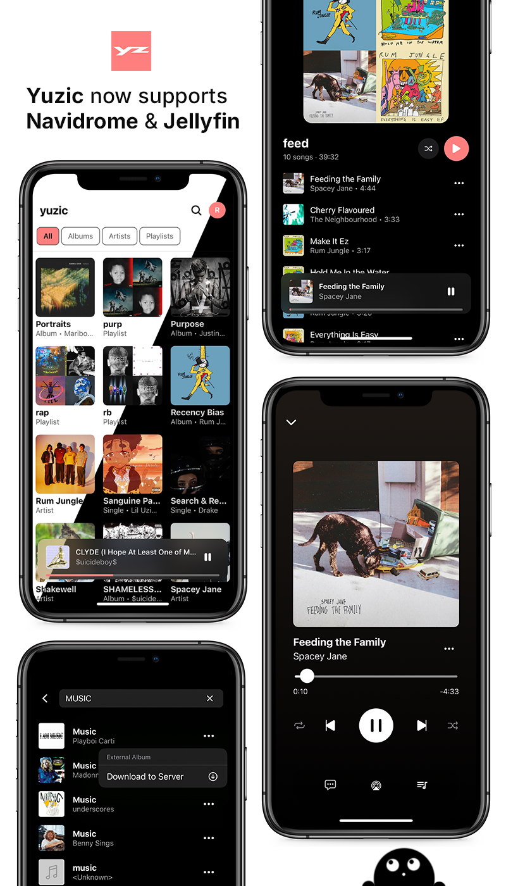

## Contents

- [Info](#info)
- [Download](#download)
- [Features](#features)
- [Future](#future)
- [Screenshots](#screenshots)
- [Contribution](#Contribution)

## Info
Yuzic is a cross platform opensource music player for Navidrome and Jellyfin. Built with React Native and Expo.

This project started in December of 2024. The goal of this app is to encompass all of your music needs in relation to your server. I have a huge appreciation for UI and UX, and minimal interfaces. That's the approach I took for this app.

Yuzic provides a Navidrome demo but requires a self-hosted Jellyfin or Subsonic server to function as intended.

## Download

### IOS

[IPA](https://github.com/eftpmc/yuzic/releases)

### Android

[APK](https://github.com/eftpmc/yuzic/releases)

## Features
- Unified Music Library Across Servers
- Offline & Download Support
- Customizable UI & Layout
- A pretty UI
- Search & Browsing
- Text-to-Music
- Privacy-First by Design
- Fast, Reliable Playback
- Plugins

## Future
- Crossfading
- Carplay & Android auto
- QuickConnect
- Apple TV app
- Apple watch
- Google casting
- F-droid
- Plex
- EQ
- Lyrion
- UPNP or DLNA
- Ollama

## Screenshots

Screenshots taken on iPhone 13

### Home

  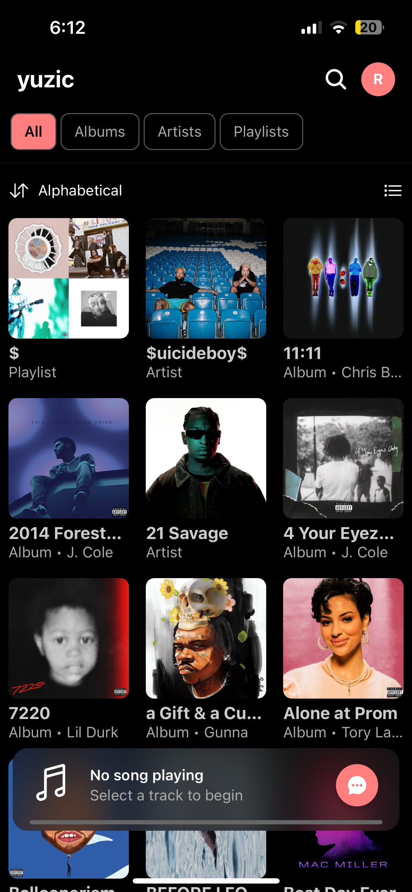
  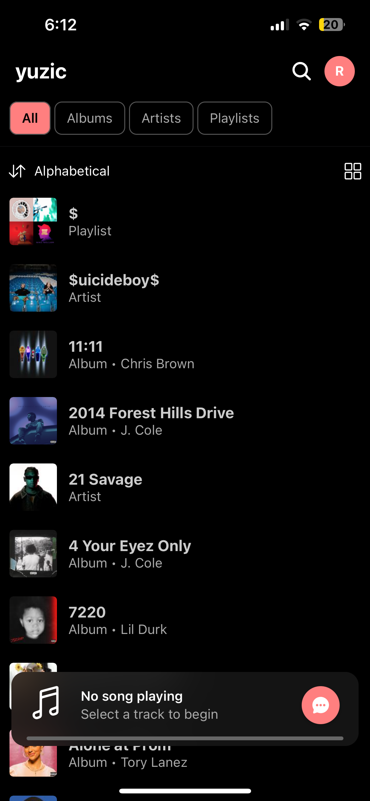

### Playing

  
  

### Album

  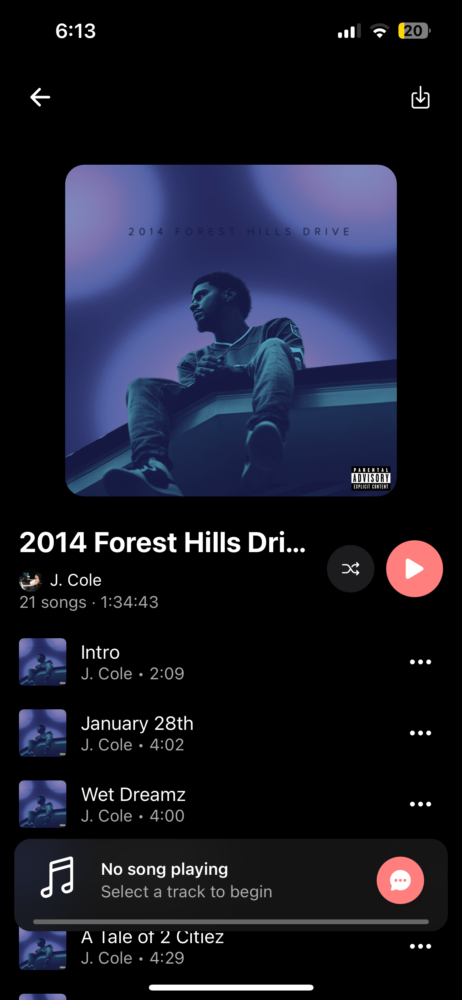

### Artist

  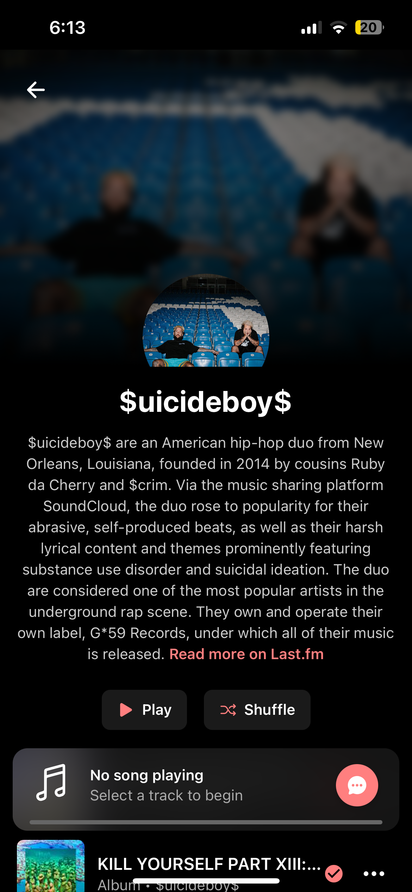

### Playlist

  

### Onboarding

  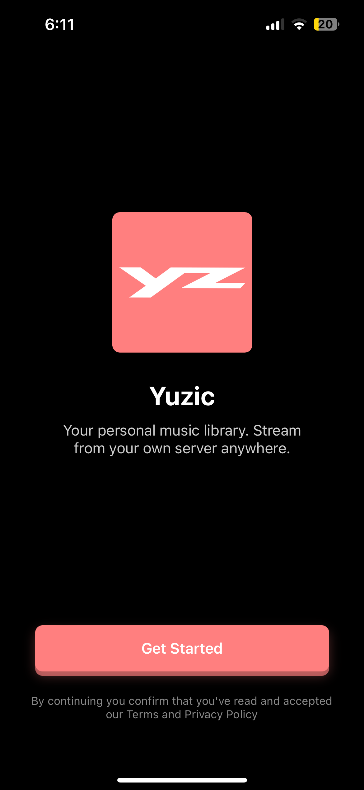
  
  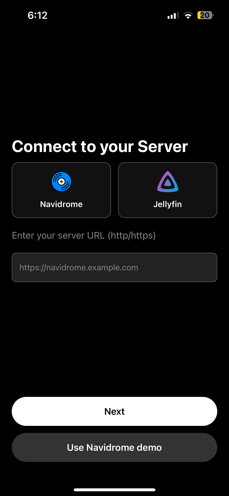
  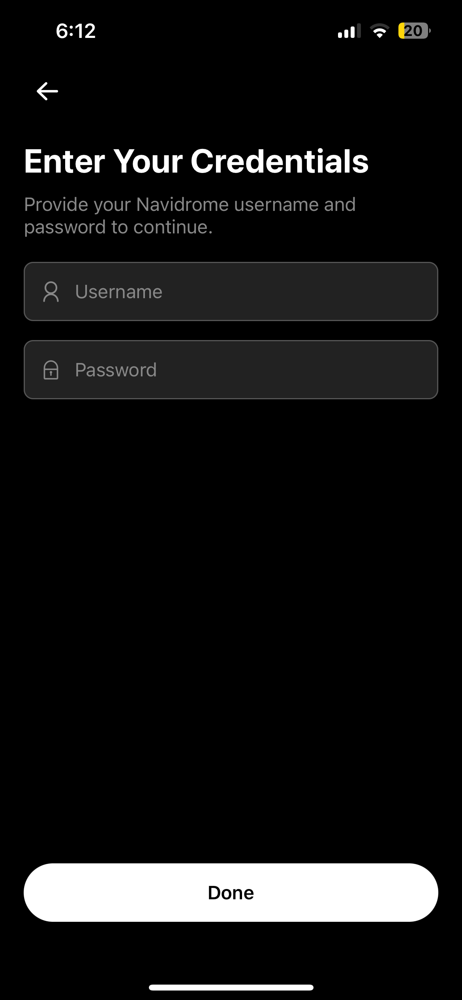

### Search

  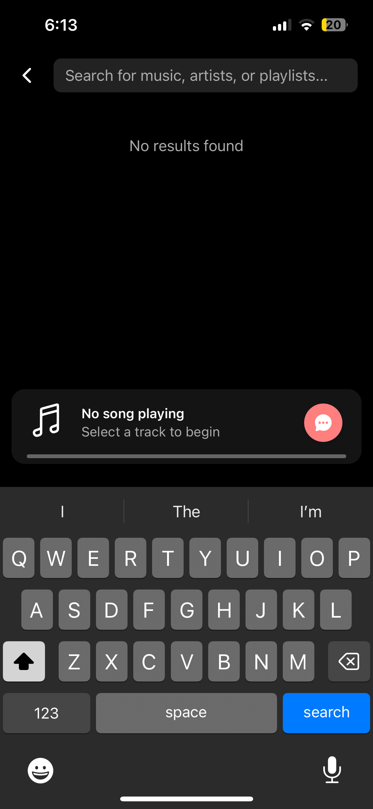
  

### Settings

  
  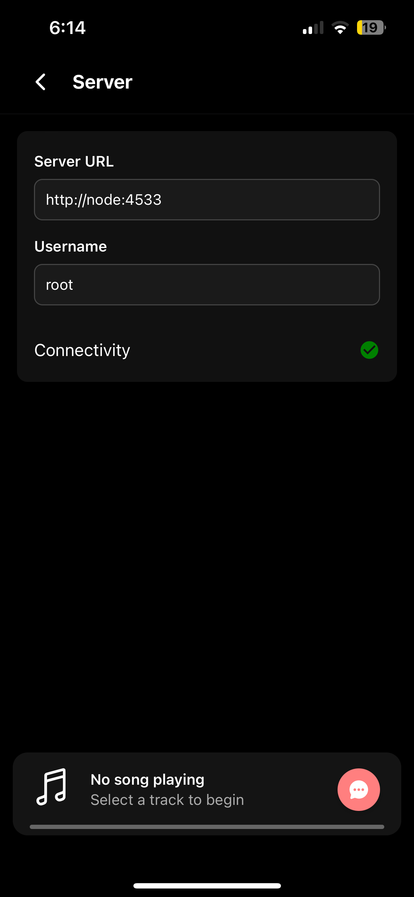
  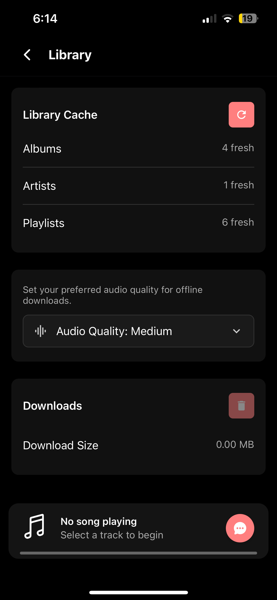
  
  

### Plugins

  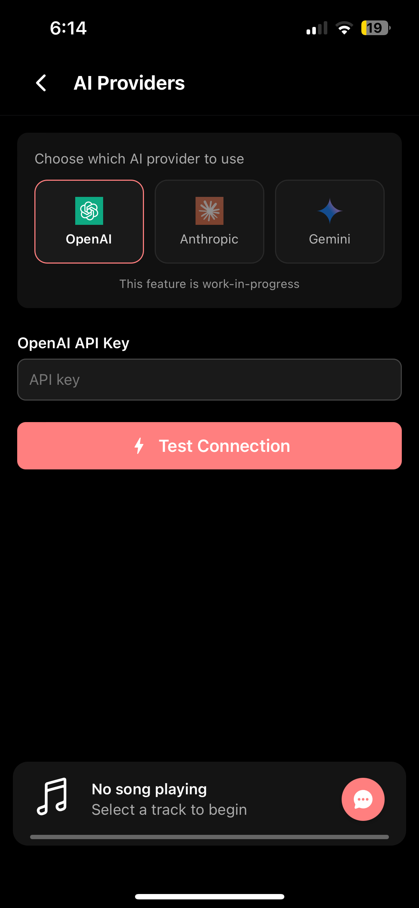

## Contribution
Contributions are welcome! Please open an issue or submit a pull request.
